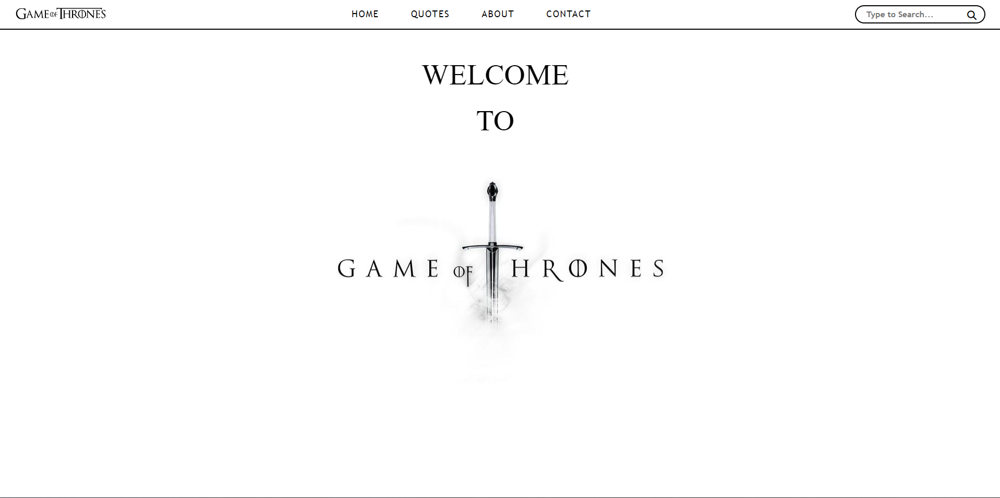
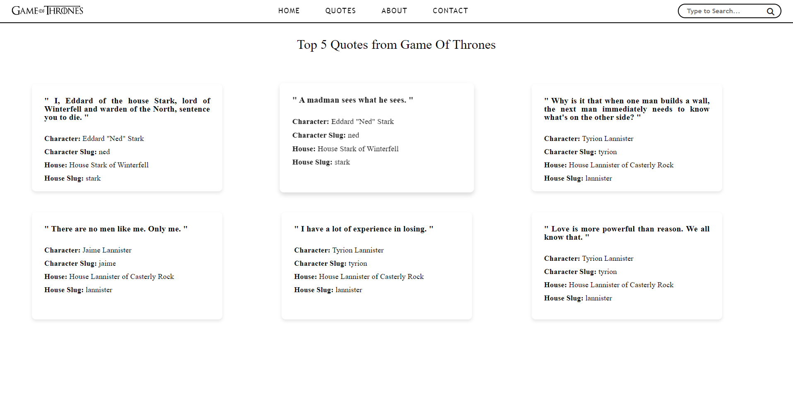
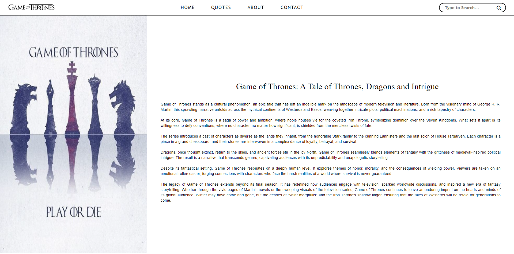
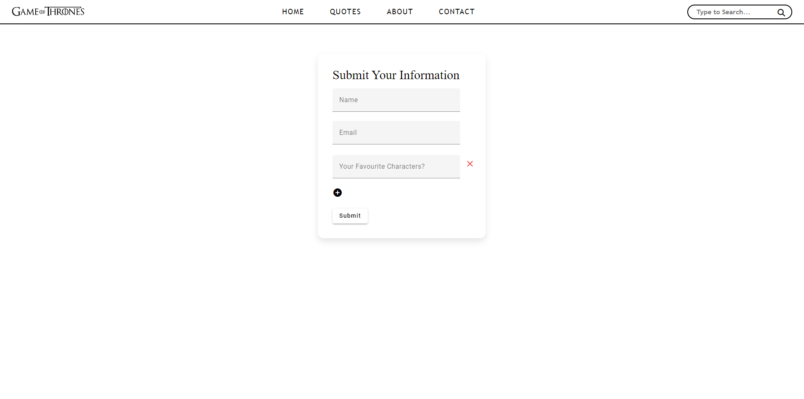

#Task2-Industial Attachment SELISE

This Angular project is a simple tool that fetches random quotes from an API and displays them in an elegant card view. The application also features a reactive form that allows users to interact with and contribute their favorite quotes.

